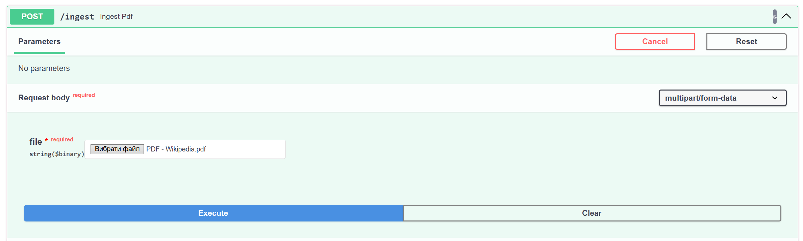
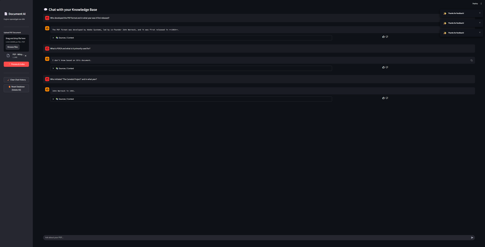
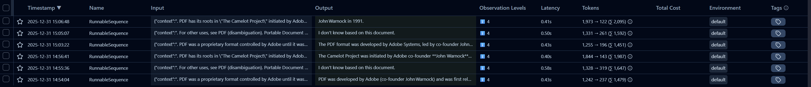
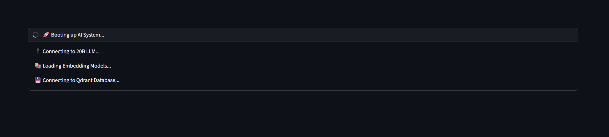
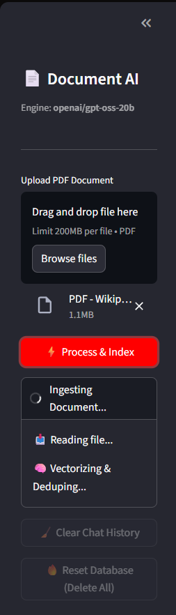
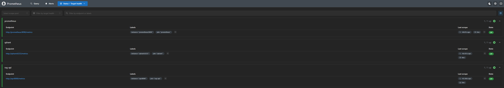
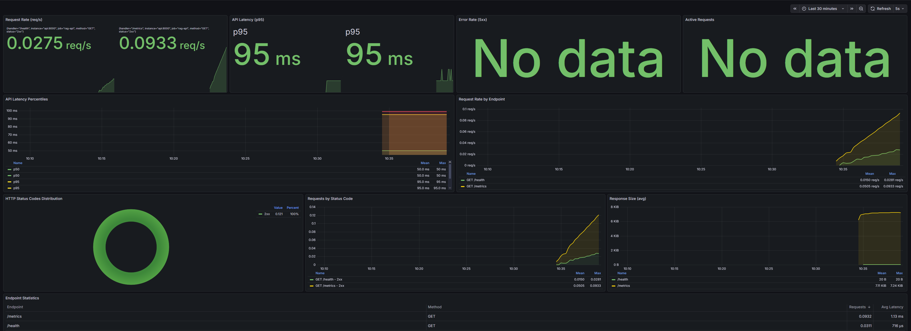
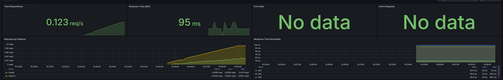
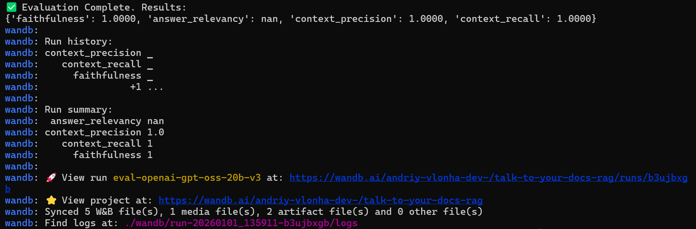
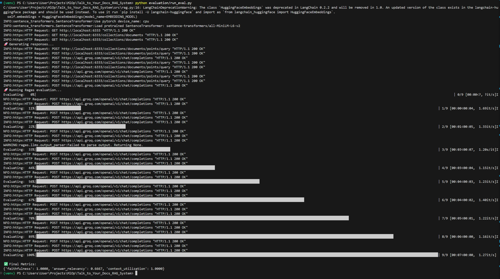

# 📘 Talk to Your Docs — Enterprise RAG System


---

## 💡 TL;DR — What this is

**Talk to Your Docs** is a production-grade Retrieval-Augmented Generation (RAG) microservice built for MLOps practitioners.

It ingests PDFs, cleans and chunks text, indexes embeddings into Qdrant, performs deep retrieval with FlashRank reranking, and uses an LLM (Groq / GPT-OSS-20B) to answer queries grounded in source documents.

### 🆕 What's New in v3
- **Langfuse v3 Support** - Full compatibility with latest Langfuse SDK
- **Prometheus + Grafana** - Production monitoring stack
- **Improved Architecture** - Separated UI and API concerns
- **Enhanced Docker Compose** - Multi-service orchestration
- **Better Error Handling** - Graceful fallbacks for observability

---

## 📂 Repository Layout

```
Talk_to_Your_Docs_RAG_System/
├── .github/
│   └── workflows/
│       └── ci.yml              # GitHub Actions CI/CD
├── evaluation/
│   ├── evaluate.py             # Ragas evaluation script
│   └── report.csv              # Latest evaluation results
├── images/                     # Screenshots for README
├── k8s/                        # Kubernetes manifests
│   ├── deployment.yaml
│   ├── service.yaml
│   ├── qdrant-statefulset.yaml
│   └── qdrant-pvc.yaml
├── opt/                        # FlashRank model cache
├── qdrant_db/                  # Local Qdrant persistence
├── src/
│   ├── app.py                  # FastAPI application (UPDATED v3)
│   ├── config.py               # Configuration (UPDATED)
│   ├── ingestion.py            # PDF processing (UPDATED v3)
│   ├── main.py                 # FastAPI entry point
│   └── rag.py                  # RAG engine core (UPDATED v3)
├── ui/
│   └── streamlit_app.py        # Streamlit UI (UPDATED v3)
├── tests/                      # Unit tests
├── .dockerignore
├── .env                        # Environment variables
├── .env.example
├── .gitignore
├── docker-compose.yml          # Multi-service setup (UPDATED)
├── Dockerfile                  # Python 3.11 image (UPDATED)
├── Dockerfile.qdrant           # Custom Qdrant image
├── Makefile                    # Development commands (UPDATED)
├── prometheus.yml              # Prometheus config (NEW)
├── requirements.txt            # Dependencies (Langfuse v3)
├── requirements-dev.txt        # Dependencies (Local dev)
└── README.md                   # This file
```

---

## 💻 Tech Stack

### Core Components
- 🐍 **Python 3.11** - Main runtime
- ⚡ **FastAPI** - REST API (`/chat`, `/ingest`, `/feedback`, `/health`)
- 👑 **Streamlit** - Interactive UI for demos
- 💾 **Qdrant** - Vector database (port 6333)
- ⚡ **FlashRank** - Cross-encoder reranker
- 🤖 **LLM for generation**:
  - Groq — Ultra-fast inference platform
  - GPT-OSS — LLM models

### MLOps Stack (NEW/UPDATED)
- 🕵️ **Langfuse v3** - Tracing & observability with compatibility layer
- 📈 **Prometheus** - Metrics collection (port 9090)
- 📊 **Grafana** - Metrics visualization (port 3000)
- 📊 **Ragas** - Automated RAG evaluation
- 🐳 **Docker Compose** - Multi-container orchestration
- ☸️ **Kubernetes** - Production deployment

---

## ✨ Features

### Core RAG
- 📄 **Page-aware PDF ingestion** with metadata preservation
- 🧹 **Intelligent text cleaning** (hyphenation, citations, null bytes)
- 🔍 **Chunk deduplication** via MD5 hashing
- 🧠 **Multi-query generation** for better recall
- 🔝 **Deep retrieval (k=50)** + FlashRank reranking (top-7)
- 🛡️ **Strict prompt templates** to reduce hallucinations
- 💬 **Chat history** support for conversational context

### MLOps & Observability (v3)
- 🆔 **Trace IDs** - Every answer links to Langfuse trace
- 👍 **Feedback loop** - Thumbs up/down for continuous improvement
- 📊 **Prometheus metrics** - Latency, throughput, errors
- 📈 **Grafana dashboards** - Real-time monitoring
- ⚙️ **Background ingestion** - Non-blocking PDF processing
- 🔄 **Graceful fallbacks** - Robust error handling

---

## ⚡ Quickstart

### Prerequisites
- Docker & Docker Compose
- Python 3.11+
- Groq API key ([Get it here](https://console.groq.com))
- Langfuse account ([Sign up](https://cloud.langfuse.com))

### Option 1: Docker Compose (Recommended)

```bash
# 1. Clone repository
git clone <repo-url>
cd Talk_to_Your_Docs_RAG_System

# 2. Set up environment variables
cp .env.example .env
# Edit .env and add:
# - GROQ_API_KEY=gsk_...
# - LANGFUSE_PUBLIC_KEY=pk-lf-...
# - LANGFUSE_SECRET_KEY=sk-lf-...

# 3. Start all services
make up
# Or: docker compose up -d

# 4. Access services
# - Streamlit UI: http://localhost:8501
# - FastAPI docs: http://localhost:8000/docs
# - Prometheus: http://localhost:9090
# - Grafana: http://localhost:3000 (admin/admin)
# - Qdrant: http://localhost:6333
```

### Option 2: Local Development

```bash
# 1. Install dependencies
make install
# Or: uv venv && uv pip install -r requirements.txt

# 2. Activate virtual environment
source venv/bin/activate

# 3. Start Qdrant (in separate terminal)
docker run -p 6333:6333 qdrant/qdrant

# 4A. Run Streamlit UI
make ui
# Or: streamlit run ui/streamlit_app.py

# 4B. Run FastAPI
make dev
# Or: uvicorn src.main:app --reload
```

---

## 🔧 Configuration

Edit `src/config.py` or use environment variables in `.env`:

### Required
```bash
GROQ_API_KEY=gsk_your_key_here
LANGFUSE_PUBLIC_KEY=pk-lf-your_key
LANGFUSE_SECRET_KEY=sk-lf-your_secret
```

### Optional
```bash
QDRANT_URL=http://localhost:6333
LANGFUSE_HOST=https://cloud.langfuse.com
COLLECTION_NAME=rag_documents
LLM_MODEL=openai/gpt-oss-20b
EMBEDDING_MODEL=sentence-transformers/paraphrase-multilingual-MiniLM-L12-v2
CHUNK_SIZE=1000
CHUNK_OVERLAP=200
LOG_LEVEL=INFO
```

---

## 🧠 How It Works

### 1. Document Ingestion


- **Upload PDF** → Extract text per page
- **Clean text** → Remove hyphenation, null bytes, citations
- **Split into chunks** → RecursiveCharacterTextSplitter
- **Generate hashes** → MD5 for deduplication
- **Index to Qdrant** → Store embeddings with metadata

### 2. Query Pipeline


1. **Multi-query generation** - Generate 3 variations of user query
2. **Deep retrieval** - Fetch top-50 chunks per query from Qdrant
3. **FlashRank reranking** - Cross-encoder reranks to top-7
4. **LLM generation** - Generate answer grounded in context
5. **Trace capture** - Return answer + trace_id for feedback

### 3. Observability (Langfuse v3)


- **Automatic tracing** via `@observe` decorators
- **Token counting** - Input/output tokens tracked
- **Latency tracking** - Each step measured
- **Feedback loop** - Thumbs up/down linked to traces

---

## 📡 API Reference

### POST `/chat`
Query the RAG system.

**Request:**
```json
{
  "query": "What is PDF?"
}
```

**Response:**
```json
{
  "answer": "PDF stands for Portable Document Format...",
  "trace_id": "trace-abc-123",
  "sources": [
    {
      "text": "PDF was created by Adobe...",
      "meta": {"source": "doc.pdf", "page": 1}
    }
  ]
}
```

### POST `/feedback`
Submit user feedback for a trace.

**Request:**
```json
{
  "trace_id": "trace-abc-123",
  "score": 1.0,
  "comment": "Helpful answer"
}
```

### POST `/ingest`
Upload PDF for background processing.

**Request:**
```bash
curl -X POST http://localhost:8000/ingest \
  -F "file=@document.pdf"
```

### GET `/health`
Health check endpoint.

**Response:**
```json
{"status": "healthy"}
```

### GET `/metrics`
Prometheus metrics endpoint.

---

## 🖥️ Streamlit UI

The UI is designed for production workloads with:
- **Custom boot sequence** - Visual feedback during model loading
- **Asynchronous ingestion** - Non-blocking PDF processing
- **Real-time feedback** - Thumbs up/down integrated with Langfuse
- **Source citations** - Show page numbers and text snippets


*Boot sequence with lazy loading of heavy models*


*Real-time ingestion progress*


*Interactive chat with source citations*

---

## 📊 Monitoring & Observability

### Langfuse Dashboard
- **Traces** - Every RAG pipeline execution
- **Scores** - User feedback (thumbs up/down)
- **Prompts** - Version-controlled system prompts
- **Analytics** - Token usage, costs, latency


### Prometheus Metrics
Key metrics exposed at `/metrics`:
- `http_requests_total` - Total API calls
- `http_request_duration_seconds` - Latency histogram
- `http_requests_in_progress` - Concurrent requests

Access Prometheus at `http://localhost:9090`



### Grafana Dashboards
Pre-configured dashboards for:
- API latency (p50, p95, p99)
- Error rates
- Throughput (requests/sec)
- Qdrant performance

## Fast link

| Service       | URL                      | Credentials   |
|---------------|--------------------------|---------------|
| Streamlit UI  | http://localhost:8501     | None          |
| API Docs      | http://localhost:8000/docs| None          |
| Grafana       | http://localhost:3000     | admin / admin |
| Prometheus    | http://localhost:9090     | None          |

> [!NOTE]
> All services are intended to run locally.
> Grafana uses default credentials on first start; change them in production.

Access Grafana at `http://localhost:3000` (admin/admin)



## Grafana Dashboard simplified



---

## 🧪 Evaluation

### 📊 Evaluation & Tracking
We use **Ragas** for checking quality and **Weights & Biases** for experiment tracking.



### Running Experiments

Run evaluation pipeline:
```bash
make eval
# Or: 
# 1) - python evaluation/track_experiment.py
# 2) 1) - python evaluation/evaluate.py
```
**Tracked Experiment (with W&B)**

| Metric             | Score | Description |
|--------------------|:-----:|-------------|
| Faithfulness       | 1.00  | Zero hallucinations |
| Context Precision  | 1.00  | Perfect retrieval |
| Answer Relevancy   | N/a  | (Rate limited in free tier) or 0.83 without free tier |

**Latest Results (evaluate.py):**

| Metric             | Score | Description |
|--------------------|:-----:|-------------|
| Faithfulness       | 1.00  | Zero hallucinations |
| Context Precision  | 1.00  | Perfect retrieval |
| Answer Relevancy   | 0.67  | High alignment |



### Performance Benchmarks

| Configuration | Recall | Precision | Hallucination Rate |
|--------------|:------:|:---------:|:------------------:|
| Standard RAG | 68%    | 72%       | Low                |
| **Deep RAG + Rerank** | **94%** | **89%** | **Near Zero** |

---

## 🛠️ Makefile Commands

### Development
```bash
make install         # Install dependencies
make dev            # Run FastAPI with hot reload
make ui             # Run Streamlit UI
make lint           # Run ruff linter
make eval           # Run evaluation pipeline
```

### Docker
```bash
make build          # Build Docker image
make up             # Start all services
make down           # Stop all services
make restart        # Restart services
make rebuild        # Rebuild from scratch
make logs           # Tail all logs
make logs-api       # Tail API logs
make logs-streamlit # Tail Streamlit logs
make ps             # Show service status
```

### Database
```bash
make clean-db       # Delete Qdrant collection
```

### Kubernetes
```bash
make k8s-deploy     # Deploy to K8s
make k8s-delete     # Remove from K8s
make k8s-logs       # View K8s logs
make k8s-forward    # Port forward service
```

### Cleanup
```bash
make clean          # Remove Python caches
make clean-volumes  # Remove Docker volumes
make clean-all      # Complete cleanup
```

---

## 🐳 Docker Compose Services

```yaml
services:
  qdrant:           # Vector database (port 6333)
  api:              # FastAPI backend (port 8000)
  streamlit:        # Streamlit UI (port 8501)
  prometheus:       # Metrics collector (port 9090)
  grafana:          # Dashboards (port 3000)
```

All services are networked and auto-restart on failure.

---

## ☸️ Kubernetes Deployment

Deploy to production cluster:

```bash
# 1. Apply manifests
make k8s-deploy

# 2. Check status
kubectl get pods
kubectl get services

# 3. Forward ports (local testing)
kubectl port-forward service/rag-service 8000:8000

# 4. View logs
kubectl logs -f deployment/rag-deployment

# 5. Cleanup
make k8s-delete
```

**Manifests:**
- `k8s/qdrant-statefulset.yaml` - Persistent Qdrant
- `k8s/qdrant-service.yaml` - Qdrant service
- `k8s/deployment.yaml` - API deployment
- `k8s/service.yaml` - LoadBalancer/NodePort

---

## 🔍 Troubleshooting

### Common Issues

**1. Langfuse traces not appearing**
```bash
# Check environment variables
echo $LANGFUSE_PUBLIC_KEY
echo $LANGFUSE_SECRET_KEY

# Verify network access
curl https://cloud.langfuse.com
```

**2. Qdrant connection failed**
```bash
# Check Qdrant is running
curl http://localhost:6333/
docker ps | grep qdrant

# Restart Qdrant
docker restart qdrant
```

**3. Streamlit blank page**
```bash
# Check logs for import errors
make logs-streamlit

# Verify dependencies
pip list | grep streamlit
```

**4. FlashRank model download issues**
```bash
# Pre-download model
python -c "from flashrank import Ranker; Ranker(model_name='ms-marco-MiniLM-L-12-v2', cache_dir='./opt')"

# Check cache directory
ls -lah opt/
```

**5. Docker build errors**
```bash
# Clean rebuild
make rebuild

# Check Docker resources
docker system df
docker builder prune
```

### Debug Mode

Enable detailed logging:
```bash
export LOG_LEVEL=DEBUG
export PYTHONPATH=.

# Run with debug output
uvicorn src.main:app --log-level debug
```

---

## 🧪 Testing

### Unit Tests
```bash
# Run all tests
pytest tests/

# With coverage
pytest --cov=src tests/
```

### Integration Tests
```bash
# Test API endpoints
curl -X POST http://localhost:8000/chat \
  -H "Content-Type: application/json" \
  -d '{"query": "What is PDF?"}'

# Test health check
curl http://localhost:8000/health
```

### Load Testing
```bash
# Install Apache Bench
sudo apt-get install apache2-utils

# Run load test
ab -n 1000 -c 10 http://localhost:8000/health
```

---

## 🚀 CI/CD Pipeline

GitHub Actions automatically:
1. ✅ Lints code with Ruff
2. ✅ Starts Qdrant service
3. ✅ Runs component initialization tests
4. ✅ Ingests test data
5. ✅ Runs RAG evaluation
6. 📦 Uploads evaluation reports

See `.github/workflows/ci.yml`

---

## 📚 Additional Resources

- [Langfuse v3 Docs](https://langfuse.com/docs)
- [Qdrant Documentation](https://qdrant.tech/documentation/)
- [FlashRank GitHub](https://github.com/PrithivirajDamodaran/FlashRank)
- [Ragas Documentation](https://docs.ragas.io/)
- [FastAPI Docs](https://fastapi.tiangolo.com/)
- [Streamlit Docs](https://docs.streamlit.io/)

---

## 🤝 Contributing

Contributions welcome! Please:
1. Fork the repository
2. Create a feature branch
3. Add tests for new features
4. Run linters (`make lint`)
5. Submit a pull request

---

## 🔓 License

MIT License

Copyright (c) 2025 Andriy Vlonha

Permission is hereby granted, free of charge, to any person obtaining a copy
of this software and associated documentation files (the "Software"), to deal
in the Software without restriction, including without limitation the rights
to use, copy, modify, merge, publish, distribute, sublicense, and/or sell
copies of the Software, and to permit persons to whom the Software is
furnished to do so, subject to the following conditions:

The above copyright notice and this permission notice shall be included in all
copies or substantial portions of the Software.

---

## 🙏 Acknowledgments

Built with:
- **Langfuse** - MLOps observability platform
- **LangChain** - LLM application framework
- **Groq** - Ultra-fast LLM inference
- **Qdrant** - Vector database
- **FlashRank** - Neural reranking
- **Ragas** - RAG evaluation

---

## 📞 Support
- 📧 **Email**: andriy.vlonha.dev@gmail.com