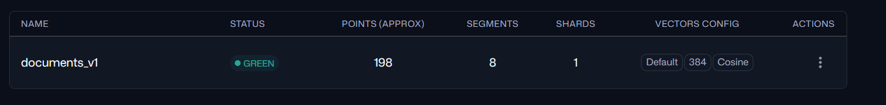
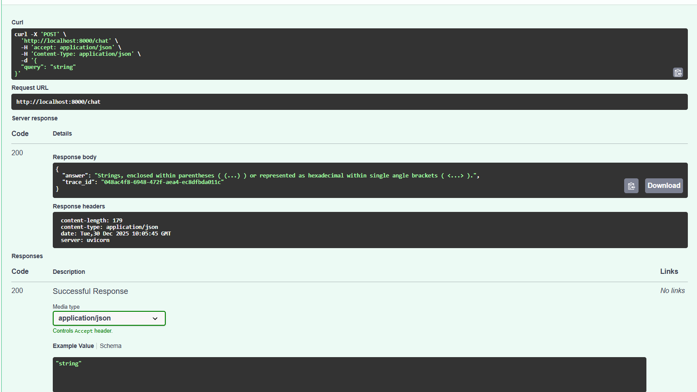
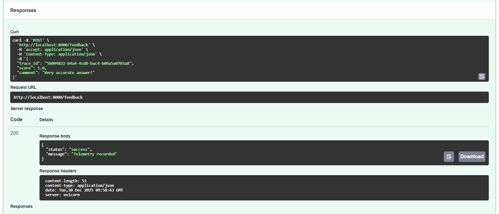
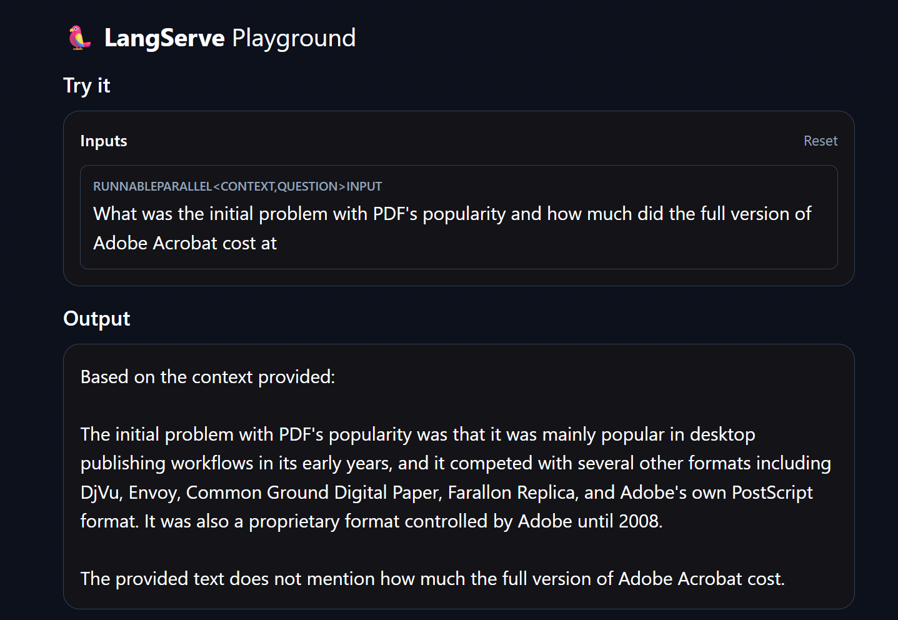
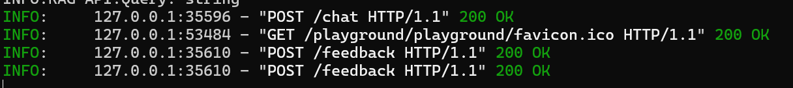
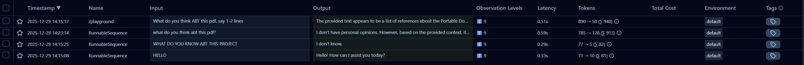

# 📘 Talk to Your Docs – Enterprise RAG System

 
 
 
 
 
 


## 📌 Project Overview
**Talk to Your Docs** is a production-ready microservice for intelligent document analysis and retrieval (RAG). Built with MLOps principles, the project includes containerization, data sanitization pipelines, persistent indexing, and automated evaluation.

The system ingests PDFs, cleans the text, chunks content for semantic retrieval, indexes embeddings in a vector store, and uses an LLM to answer user queries grounded in source documents.

## 🏗 Architecture & Structure
Modular layered architecture for scalability and maintainability.

```plaintext
Talk_to_Your_Docs_RAG_System/
├── .github/             # CI/CD (GitHub Actions for linting & tests)
├── evaluation/          # Ragas pipeline: evaluation scripts & reports
├── k8s/                 # Kubernetes manifests (Deployment, Service, StatefulSet)
├── qdrant_db/           # Persistent vector storage
├── src/
│   ├── main.py          # Entry point (FastAPI + Langserve)
│   ├── ingestion.py     # ETL: Load, Sanitize, Chunk PDFs
│   ├── rag.py           # RAG Engine with .with_config()
│   └── config.py        # Environment configuration
├── tests/               # Pytest integration tests
├── docker-compose.yml   # Local deployment orchestration
├── Dockerfile           # Multi-stage Docker build
└── Makefile             # Utility commands
```

## 💻 Technology Stack

- **Language:** Python 3.12

- **Web Framework:** FastAPI

- **RAG Framework:** LangChain (LCEL)

- **LLM Provider:** Groq (Meta Llama 4 Scout)

- **Embedding Model:** HuggingFace all-MiniLM-L6-v2

- **Vector Database:** Qdrant (Persistent storage)

- **Evaluation: Ragas** Framework

- **Infrastructure:** Docker, Kubernetes (K8s)

- **CI/CD:** GitHub Actions + Ruff (Linter)

## 🚀 Key Features

### 1. Ingestion Engine (ETL)
- **Smart Cleaning:** Remove Wikipedia artifacts, HTML, null bytes and noisy tokens before indexing.
- **Chunking Strategy:** Recursive splitting tuned for semantic completeness and context retention.


### 2. Retrieval & Generation
- **Vector Store:** Qdrant configured in persistent mode (data survives restarts).


*Dashboard showing the indexed chunks (points) ready for retrieval.*

- **High-Performance LLM:** Integrated with Groq (Llama 4 Scout) for high-throughput inference.

- **Resilience:** Retry logic to handle transient API issues (429/413 errors).

### 3. Human-in-the-Loop Feedback API
The system supports direct user feedback to improve future model performance. This is a two-step process using the **Langfuse** integration.

**Step 1: Chat & Get Trace ID**
When you query the chat, the API returns both the answer and a unique `trace_id`.



**Step 2: Submit Feedback**
Use the `trace_id` to submit a score (0.0 to 1.0) and a comment. This data is logged for dataset refinement.




### 4. Automated Evaluation Pipeline (QA)
Uses the **Ragas** framework to benchmark answer quality against source documents and track metrics over time.

### 5. Observability & Monitoring
- **Langfuse Integration:** Full tracing of every request, including retrieval context, prompt construction, and LLM latency.

- **Performance Tracking:** Real-time monitoring of token usage, execution time, and success rates.

- **Interactive Playground:** Built-in Langserve UI for rapid prototyping and testing of RAG chains.



**Latest Benchmark Results:**

| Metric             | Score | Description |
|--------------------|:-----:|-------------|
| Faithfulness       | 1.00  | Zero hallucinations — answers are grounded in source text. |
| Context Utilization| 1.00  | Retriever finds exact relevant chunks. |
| Answer Relevancy   | 0.6667  | High alignment between query and generated response. |


## 🛠 Deployment & Usage

### Option A — Local (Docker Compose)
```bash
# 1. Configure Environment
cp .env.example .env
# Add your GROQ_API_KEY

# 2. Launch Services
docker-compose up --build -d

# API Docs available at: http://localhost:8000/docs
```

### Option B — Kubernetes (K8s)
```bash
kubectl create secret generic app-secrets --from-literal=api_key=YOUR_KEY

# Deploy Database
kubectl apply -f k8s/qdrant-statefulset.yaml
kubectl apply -f k8s/qdrant-service.yaml

# Deploy API
kubectl apply -f k8s/deployment.yaml
kubectl apply -f k8s/service.yaml
```

### Option C — Development
```bash
python -m venv venv
source venv/bin/activate
pip install -r requirements.txt

# Run server
uvicorn src.main:app --reload
```

## 🧪 Testing & CI/CD
- **Linting:** `ruff` runs on each push.
- **Unit Tests:** `pytest` for API and integration tests.
- **Evaluation:** `python evaluation/run_eval.py` generates quality reports.

## 👨‍💻 API Endpoints & Interfaces
- `POST /ingest` — Upload and index a PDF document.
- `POST /chat` — Query the indexed knowledge base with full tracing.
- `GET /metrics` — Prometheus-compatible metrics endpoint.
- `GET /playground/playground` — Interactive UI for testing RAG logic (Langserve).

## 🔍 System in Action & Observability

We use **Langfuse** to trace every step of the RAG pipeline. Additionally, the server provides detailed logging for debugging ingestion and feedback flows.


*Real-time server logs showing Chat interactions and Feedback ingestion.*

### Real-Time Tracing Example
Below is a trace of a complex query where the system retrieves context from a 100-page PDF:



**Key Insights from the Trace:**
- **Context Injection:** Notice the jump from ~80 tokens (baseline) to **940 tokens**, confirming that relevant chunks were successfully retrieved and injected into the prompt.
- **Latency Tracking:** The end-to-end response time (including retrieval and generation) is captured for performance bottleneck analysis.
- **Granular Steps:** Each trace contains 9 "Observation Levels," covering everything from the initial query to the final LLM output.

## Compare

| Query Type           | Input Tokens | Output Tokens | Total Tokens | Result            |
|----------------------|:------------:|:-------------:|:------------:|-------------------|
| General (Hello)      | 71           | 10            | 81           | General Response  |
| RAG (via PDF)        | 890          | 50            | 940          | Grounded Answer   |


## 🔓 License 

MIT License

Copyright (c) 2025 Andriy Vlonha

Permission is hereby granted, free of charge, to any person obtaining a copy of this software and associated documentation files (the "Software"), to deal in the Software without restriction, including without limitation the rights to use, copy, modify, merge, publish, distribute, sublicense, and/or sell copies of the Software, and to permit persons to whom the Software is furnished to do so, subject to the following conditions:

The above copyright notice and this permission notice shall be included in all copies or substantial portions of the Software.