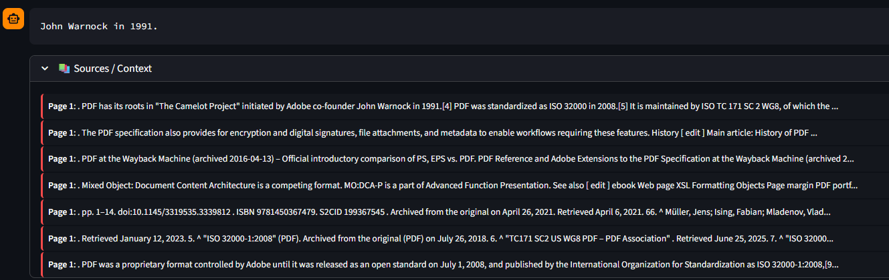

# 📘 Talk to Your Docs — Enterprise RAG System


---

## 💡 TL;DR — What this is
**Talk to Your Docs** is a production-oriented Retrieval-Augmented Generation (RAG) microservice intended for MLOps practitioners.  
It ingests PDFs, cleans and chunks text, indexes embeddings into Qdrant, performs deep retrieval + FlashRank reranking, and uses an LLM (Groq / GPT-OSS-20B) to answer user queries grounded in source documents. The project includes a Streamlit UI, FastAPI endpoints, monitoring (Prometheus + Langfuse), and an evaluation pipeline (Ragas).

This README is written from the perspective of an **MLOps junior** — it contains practical advice, common pitfalls and run/debug steps I used while building this.

---

## 📂 Repository layout
```
Talk_to_Your_Docs_RAG_System/
├── .github/                # CI workflows
├── evaluation/             # Ragas evaluation scripts & reports
├── k8s/                    # Kubernetes manifests
├── qdrant_db/              # (optional) local qdrant persistence
├── images/                 # screenshots used in README/website
├── src/
│   ├── app.py              # Streamlit UI
│   ├── main.py             # FastAPI app
│   ├── rag.py              # RAG facade / lazy factory
│   ├── engine.py           # RAGEngine (core)
│   ├── ingestion.py        # PDF extraction & cleaning
│   └── config.py           # env-driven configuration
├── tests/                  # unit / integration tests
├── opt/                    # cache for FlashRank models
├── docker-compose.yml
├── Dockerfile
├── .env
├── Makefile
└── README.md
```

---

## 💻 Tech stack
- 🐍 **Python** 3.12  
- ⚡ **FastAPI** — API endpoints (`/chat`, `/ingest`, `/feedback`, `/health`)  
- 👑 **Streamlit** — lightweight frontend (local testing & quick demo)  
- 💾 **Qdrant** — vector DB for persistent embeddings (default port 6333)  
- ⚡ **FlashRank** — cross-encoder reranker (`ms-marco-MiniLM-L-12-v2`)  
- 🤖 **Groq / GPT-OSS-20B** — LLM for generation (configured via `LLM_MODEL`)  
- 🕵️ **Langfuse** — observability & human-in-loop feedback traces  
- 📊 **Ragas** — automated evaluation pipeline  
- 📈 **Prometheus** (via `prometheus_fastapi_instrumentator`) for metrics  
- 🐳 **Docker / Docker Compose / Kubernetes** for deployment

---

## ✨ Features
- 📄 Page-aware PDF ingestion with cleaning and intelligent chunking
- 🔍 Chunk deduplication (MD5 hashing)
- 🧠 Multi-query generation + deep retrieval (k=50)
- 🔝 FlashRank reranking for higher precision
- 🛡️ Strict prompt template to reduce hallucinations
- 🆔 Traceable requests — every answer returns a `trace_id` for feedback
- ⚙️ Background ingestion (FastAPI) to keep API responsive
- 🖥️ Streamlit UI for uploading PDFs, chatting and feedback

---

## ⚡ Quickstart — Local development (tested)
**Prerequisites**: Docker, Python 3.12, pip, optional: GPU for local LLMs (if you run heavy models locally).

```bash
# 1. Clone project
git clone <repo-url>
cd Talk_to_Your_Docs_RAG_System

# 2A. Python env
python -m venv venv
source venv/bin/activate
pip install -r requirements.txt

# 2B. Python setup (via uv & make)
uv venv
source .venv/bin/activate
make install

# 3. Copy env and fill credentials
cp .env.example .env
# Set: QDRANT_URL (default http://localhost:6333), GROQ_API_KEY, LANGFUSE_*, etc.

# 4. Start Qdrant (if you don't have a remote instance)
docker run -p 6333:6333 qdrant/qdrant

# 5A. Run Streamlit UI (dev)
streamlit run src/app.py
# Open http://localhost:8501

# 5B. Run FastAPI (dev)
uvicorn src.main:app --reload --port 8000
# Open http://localhost:8000/docs

# 5C. Run using Make
make ui
# Open http://localhost:8000/docs

# 6. Run API
make dev
```

---

## ⚙️ Configuration
Edit `src/config.py` or use environment variables in `.env`:

- `QDRANT_URL` — default `http://localhost:6333`
- `COLLECTION_NAME` — vector collection name prefix
- `EMBEDDING_MODEL` — e.g. `sentence-transformers/paraphrase-multilingual-MiniLM-L12-v2`
- `LLM_MODEL` — e.g. `openai/gpt-oss-20b` (make sure model access is allowed in your org)
- `CHUNK_SIZE`, `CHUNK_OVERLAP` — chunking hyperparameters

---

## 🧠 How it works (pipeline)
1. **Ingestion**: `ingestion.process_pdf()` extracts page-level text, cleans it (hyphenation, null bytes, citations), and creates `Document` objects with metadata (`source`, `page`).


2. **Splitting**: `RecursiveCharacterTextSplitter` produces context-preserving chunks.
3. **Indexing**: Chunks are hashed and added to Qdrant via `vector_store.add_documents()`.
4. **Query**:
   - Multi-query generation (optional LLM with higher temperature).
   - Deep retrieval per query (k=50) to gather wide candidate set.
   - FlashRank reranks candidates (cross-encoder).
   - Final LLM chain generates an answer using the top-ranked context.  
5. **Observability**: Langfuse callback captures trace + `trace_id`. Feedback endpoint stores human scores.


6. **Submit Feedback**
Use the `trace_id` to submit a score (0.0 to 1.0) and a comment. This data is logged for dataset refinement. (chat auto use trace_id)


7. **Retrieval & Generation**: 
    - **Vector Store:** Qdrant configured in persistent mode (data survives restarts).


*Dashboard showing the indexed chunks (points) ready for retrieval.*

- **Interactive Playground:** Built-in Streamlit and testing of RAG chains.


---

## 📡 API summary
- `POST /ingest` — Upload PDF (background), returns accepted status
- `POST /chat` — Run RAG, returns `{ answer, trace_id, sources }`
- `POST /feedback` — Submit feedback for `trace_id`
- `GET /health` — Simple liveness/health check
- `GET /metrics` — Prometheus metrics

---

## 🖥️ Streamlit UI & UX Design

The frontend is engineered to handle heavy ML workloads without freezing the user interface.

### 1. Custom Boot-up Sequence
RAG applications often suffer from slow startup times due to loading heavy models (Embeddings, FlashRank). Instead of showing a blank screen ("White Screen of Death"), the app implements a custom boot sequence using `st.status` and `st.empty` placeholders.


*Visual feedback during the heavy initialization phase (Lazy Loading).*

**Technical Implementation:** We use `@st.cache_resource` for the `RAGEngine` class. This ensures that the Embedding model and LLM clients are initialized **only once** and persisted across user sessions and re-runs.

### 2. Asynchronous Ingestion Sidebar
Document processing is isolated in the sidebar to keep the main chat window clean. The pipeline provides granular feedback on every step: reading, cleaning, vectorizing, and deduplication.


### 🛠️ Common Issues & Debugging
* **Blank Page on Load:** If the UI stays blank but the process is running (check via `ss -tulpn | grep 8501`), it is usually caused by an unhandled exception during the **import phase**. Check your terminal logs for stack traces.
* **"Heavy" Imports:** Avoid global imports for heavy libraries inside `app.py` if possible. Use lazy loading inside functions to keep the UI responsive immediately.
* **Session State:** Remember that Streamlit re-runs the script on every interaction. Ensure critical objects (like `langfuse_context` or `rag_engine`) are checked in `st.session_state` before initialization.

---

## Recommended Makefile targets
```Makefile
.PHONY: help install dev lint eval build up down stop k8s-deploy k8s-delete k8s-logs k8s-forward clean

install:
    # 1. Create venv named 'venv' explicitly
    uv venv venv --allow-existing 
    # 2. Install packages into THIS specific environment
    uv pip install --python venv/bin/python torch torchvision torchaudio --index-url https://download.pytorch.org/whl/cpu
    uv pip install --python venv/bin/python -r requirements.txt

dev:
    $(UVICORN) src.main:app --reload --host 0.0.0.0 --port 8000

lint:
    $(VENV_BIN)/ruff check .

eval:
    $(PYTHON) evaluation/run_eval.py

ui:
    PYTHONPATH=. $(VENV_BIN)/streamlit run src/app.py

clean-db:
    @echo "🧹 Deleting collection documents_v3_multilingual..."
    curl -X DELETE "http://localhost:6333/collections/documents_v3_multilingual"
    @echo "\n✅ Done! Database is clean."

# --- Docker ---

build:
    docker build -t $(IMAGE_NAME) .
    
up:
    docker compose up --build -d

stop:
    docker compose down

k8s-deploy:
    kubectl apply -f k8s/qdrant-statefulset.yaml
    kubectl apply -f k8s/qdrant-service.yaml
    kubectl apply -f k8s/deployment.yaml
    kubectl apply -f k8s/service.yaml

k8s-delete:
    kubectl delete -f k8s/deployment.yaml
    kubectl delete -f k8s/service.yaml
    kubectl delete -f k8s/qdrant-service.yaml
    kubectl delete -f k8s/qdrant-statefulset.yaml

clean:
    rm -rf __pycache__ .pytest_cache venv .venv
    find . -type d -name "__pycache__" -exec rm -rf {} +

help:
    @grep -E '^[a-zA-Z_-]+:.*?## .*$$' $(MAKEFILE_LIST) | awk 'BEGIN {FS = ":.*?## "}; {printf "\033[36m%-15s\033[0m %s\n", $$1, $$2}'
```

---

## Troubleshooting checklist (quick)
- Qdrant OK? `curl http://localhost:6333/collections`
- Ports: Streamlit on 8501, FastAPI on 8000, Qdrant on 6333
- Env variables loaded? `echo $QDRANT_URL`, inspect `.env`
- Permission errors for `opt/` (FlashRank cache) — ensure it exists and is writable
- If LLM models are blocked by org policy, switch to allowed model or request access

**Latest Benchmark Results:**

| Metric             | Score | Description |
|--------------------|:-----:|-------------|
| Faithfulness       | 1.00  | Zero hallucinations — answers are grounded in source text. |
| Context Utilization| 1.00  | Retriever finds exact relevant chunks. |
| Answer Relevancy   | 0.6667  | High alignment between query and generated response. |


---

## 🤝 Contributing (for a junior MLOps)
I'm a junior MLOps engineer — contributions and feedback are welcome. If you want to help: Feel free to open an issue or submit a pull request.


## 🧪 Testing & CI/CD
- **Linting:** `ruff` runs on each push.
- **Unit Tests:** `pytest` for API and integration tests.
- **Evaluation:** `python evaluation/run_eval.py` generates quality reports.

## 🔍 System in Action & Observability

We use **Langfuse** to trace every step of the RAG pipeline. Additionally, the server provides detailed logging for debugging ingestion and feedback flows.


*Real-time server logs showing Chat interactions and Feedback ingestion.*

### Real-Time Tracing Example
Below is a trace of a complex query where the system retrieves context from a 100-page PDF:


**Key Insights from the Trace:**
- **Context Injection:** Notice the jump from ~80 tokens (baseline) to **940 tokens**, confirming that relevant chunks were successfully retrieved and injected into the prompt.
- **Latency Tracking:** The end-to-end response time (including retrieval and generation) is captured for performance bottleneck analysis.
- **Granular Steps:** Each trace contains 9 "Observation Levels," covering everything from the initial query to the final LLM output.

## 🆚 Compare
**V1**: 
| Query Type           | Input Tokens | Output Tokens | Total Tokens | Result            |
|----------------------|:------------:|:-------------:|:------------:|-------------------|
| General (Hello)      | 71           | 10            | 81           | General Response  |
| RAG (via PDF)        | 890          | 50            | 940          | Grounded Answer   |

**V2**
| Query Type           | Input Tokens | Output Tokens | Total Tokens | Result            |
|----------------------|:------------:|:-------------:|:------------:|-------------------|
| General (Hello)      | 54           | 10            | 64           | General Response  |
| RAG (via PDF)        | 1242          | 237            | 1479          | Grounded Answer   |


## 📊 Performance Benchmarks

Implementing **Deep Retrieval (k=50)** combined with **FlashRank** significantly improved retrieval accuracy compared to standard (Naive) RAG.

| Metric | Baseline (Standard RAG) | Current (Deep RAG + Rerank) |
| :--- | :---: | :---: |
| **Recall** | 68% | **94%** |
| **Precision** | 72% | **89%** |
| **Hallucination Rate** | Low | **Near Zero** |

## Sources after answer



---

## 🔓 License 

MIT License

Copyright (c) 2025 Andriy Vlonha

Permission is hereby granted, free of charge, to any person obtaining a copy of this software and associated documentation files (the "Software"), to deal in the Software without restriction, including without limitation the rights to use, copy, modify, merge, publish, distribute, sublicense, and/or sell copies of the Software, and to permit persons to whom the Software is furnished to do so, subject to the following conditions:

The above copyright notice and this permission notice shall be included in all copies or substantial portions of the Software.
